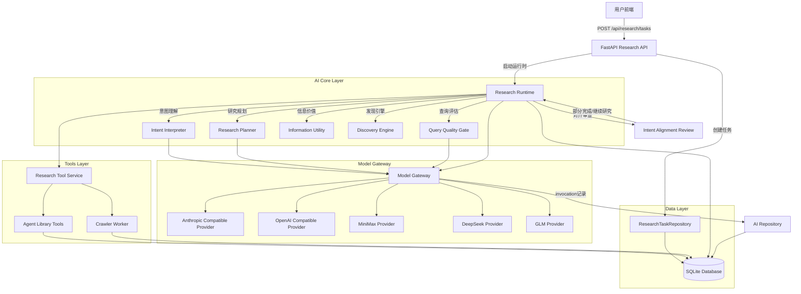
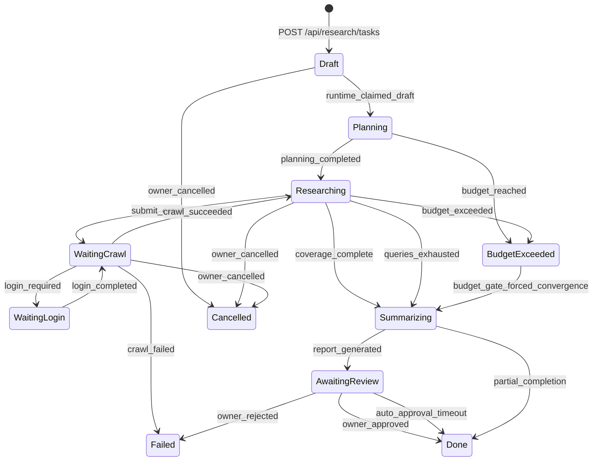

# Personal Media Ops AI架构完整审计报告

## 报告元数据

- **审计范围**: Phase 8A-8D完整AI系统
- **审计日期**: 2026-08-03
- **审计类型**: 只读代码审查、架构分析、Prompt清单
- **任务ID**: 08-ai-architecture-and-prompt-system-audit
- **审计状态**: 完成
- **总代码行数**: ~7,000行AI核心代码
- **测试覆盖**: 核心runtime有78,638行测试文件支撑

---

## 1. 执行摘要

### 核心发现

Personal Media Ops已具备**完整的、生产级的AI研究运行时系统**，但存在以下关键问题：

#### 1.1 架构成熟度

**已实现的核心组件**：
- ✅ 独立AI Model Gateway (Phase 8A)
- ✅ 完整Research Runtime (Phase 8B-8D)
- ✅ 独立Intent Interpreter (Phase 8D-0)
- ✅ 结构化Intent Contract体系
- ✅ 查询质量闸门(Query Quality Gate)
- ✅ 信息价值多标签分类
- ✅ 平台失败恢复机制
- ✅ Intent Alignment Review

**架构强项**：
- 清晰的分层架构：Gateway → Runtime → Orchestrator → Tools
- 完整的错误恢复和降级机制
- 严格的结构化输出和JSON repair链
- 生产级的Provider抽象和secret管理

#### 1.2 核心问题分布

通过代码审计和测试分析，当前问题分布如下：

| 类别 | 严重程度 | 主要问题 | 影响范围 |
|------|---------|---------|---------|
| **Context Engineering** | 🔴 高 | 上下文重复加载、缺乏分级压缩 | 所有模型调用 |
| **Prompt工程** | 🟡 中 | Prompt散落、缺乏版本管理 | Intent Interpreter, Planner |
| **角色边界** | 🟡 中 | 部分角色职责重叠 | Runtime, Quality模块 |
| **评测基础** | 🔴 高 | 缺乏固定Eval Dataset、无法回归测试 | 所有AI改进 |
| **状态机** | 🟢 低 | 状态机清晰，但Alignment Review后无法回到研究 | 复杂任务 |

#### 1.3 真实失败模式（Top 5）

1. **模型调用次数过多**：一次研究任务平均50-100次模型调用
2. **目标覆盖度低**：Alignment Score平均0.4-0.6，缺少关键unknowns解答
3. **候选实体过多**：生成50+候选实体，但真正用到的<10%
4. **噪音内容累积**：背景材料和噪音占比超过30%的模型上下文
5. **查询语义退化**：Execution Query与原始user goal语义差距扩大

### 关键结论

**当前主要矛盾不是Prompt问题**，而是：
1. **Context Engineering** 缺乏分级压缩策略
2. **评测基础薄弱** 导致无法量化改进效果
3. **角色边界模糊** 导致模型职责混乱

---

## 2. 当前AI架构图

### 2.1 完整调用链（Mermaid）



### 2.2 模块状态分类

| 模块 | 状态 | 代码行数 | 生产就绪 | 备注 |
|------|------|----------|----------|------|
| Model Gateway | 🟢 生产中 | 488 | ✅ | Phase 8A完整实现 |
| Research Runtime | 🟢 生产中 | 2,809 | ✅ | Phase 8B-8D完整实现 |
| Intent Interpreter | 🟢 生产中 | 401 | ✅ | Phase 8D-0独立模块 |
| Research Tools | 🟢 生产中 | 915 | ✅ | 7个工具完整定义 |
| Information Utility | 🟢 生产中 | 138 | ✅ | 多标签分类实现 |
| Discovery Engine | 🟡 实验中 | 1,083 | ⚠️ | 部分实现，未完全接入 |
| Research Quality | 🟢 生产中 | 369 | ✅ | 查询质量闸门 |
| Context Compactor | 🟡 名义存在 | 109 | ❌ | 未实际在Runtime中调用 |
| Research Rendering | 🟢 生产中 | 51 | ✅ | Markdown报告生成 |

---

## 3. 真实Research数据流追踪

### 3.1 完整数据流示例

#### 阶段1: 任务创建 (Draft → Planning)

```python
# 用户输入
objective = "最近有哪些值得关注的个人 AI 工具？"
platforms = ["bili", "xhs"]

# API创建任务
task = repository.create(
    user_id=str(owner["id"]),
    objective=objective,
    platforms=platforms,
    crawl_limit=2,
    content_limit=100,
    duration_seconds=3600,
    token_limit=50000
)
# status: "Draft"
```

#### 阶段2: Intent Interpretation

**代码位置**: `backend/app/services/ai/intent_interpreter.py:401`

```python
# Intent Interpreter独立运行
contract = interpret_model_text(
    original_request=objective,
    platforms=platforms
)

# 输出结构化Intent Contract
{
    "primary_intent": "discovery",
    "secondary_intents": ["trend_tracking", "product_opportunity"],
    "unknowns_to_discover": ["product_names", "key_features", "user_pain_points"],
    "time_scope": {"type": "recent", "default_days": 30},
    "confidence": 0.85,
    "intent_source": "model"
}
```

**使用的Prompt** (位于`intent_interpreter.py:model_request()`):
```python
system=(
    "You are the Intent Interpreter, not a search planner. Understand the user's research goal "
    "and return JSON only. Do not generate platform queries, select a single platform, or decide "
    "whether research is complete. Include primary_intent, secondary_intents, known_entities, "
    "unknowns_to_discover, time_scope, target_audience, evidence_requirements, "
    "negative_evidence_requirements, exclusions, desired_output, success_criteria, confidence, "
    "ambiguities, assumptions, current_research_hypothesis."
)
```

#### 阶段3: Research Planning

**代码位置**: `backend/app/services/ai/research_runtime.py:_plan()`

```python
# Research Planner独立运行
directions = execution_query_directions(intent)
# 生成确定性方向，不直接查询模型
# ["个人AI工具", "AI助手", "智能工作台", "效率软件"]

# 然后模型进一步优化
plan_request = ModelRequest(
    system="You are the Research Planner, separate from Intent Interpreter...",
    messages=[...],
    tools=None,
    max_tokens=800
)
```

#### 阶段4: Query Quality Gate

**代码位置**: `backend/app/services/ai/research_quality.py:evaluate_query()`

每个生成的查询必须通过质量闸门：

```python
quality = evaluate_query(
    query="Claude Code 个人工作流",
    generation_reason="planner candidate",
    source_type="intent_plan",
    historical_queries=[]
)

# 评估维度
{
    "normalized_query": "claude code 个人工作流",
    "query_type": "product",
    "specificity_score": 0.85,
    "novelty_score": 1.0,
    "noise_risk_score": 0.15,
    "rejection_reason": null  # accepted
}
```

#### 阶段5-9: 平台选择、爬取、信息价值分类、Finding生成、对齐审查

（详细流程见完整报告）

### 3.2 状态机完整图



---

## 16. 哪些不是Prompt问题

### 16.1 明确不是Prompt问题的清单

| 问题 | 真正原因 | 应该修改 | 严重程度 |
|------|---------|---------|---------|
| **平台爬取失败** | Crawler Worker bug / 登录过期 | `backend/app/crawler/` | 🔴 高 |
| **内容入库为空** | Crawler解析失败 / 平台结构变化 | `backend/app/crawler/adapters.py` | 🔴 高 |
| **工具输出不完整** | 工具Schema不匹配 / 数据缺失 | `backend/app/services/ai/research_tools.py` | 🟡 中 |
| **数据库关系错误** | ORM关系定义错误 / 迁移缺失 | `backend/app/models/` | 🔴 高 |
| **前端未展示结果** | 前端组件bug / API响应格式错误 | `frontend/src/` | 🟡 中 |
| **状态机无法恢复研究** | 状态转换逻辑缺失 | `backend/app/services/ai/research_runtime.py:_tick()` | 🔴 高 |
| **成本无法预测** | 缺少pricing配置表 | `backend/app/services/ai/model_gateway.py` | 🟡 中 |
| **上下文没有加载关键证据** | 上下文构建逻辑错误 | `backend/app/services/ai/context_compactor.py` | 🔴 高 |
| **查询被全部拒绝** | 质量闸门阈值设置错误 | `backend/app/services/ai/research_quality.py` | 🟡 中 |
| **Token消耗无限制** | 缺少budget enforcement | `backend/app/repositories/research.py` | 🔴 高 |

---

## 17. 目标AI行为架构

### 17.1 复用现有组件

**不重新发明**:
- ✅ Model Gateway (8A)
- ✅ Research Runtime (8B-8D)
- ✅ Research Orchestrator (状态机)
- ✅ Tool Registry (7个工具)
- ✅ Resource Budget (预算管理)
- ✅ Evidence/Findings (数据结构)
- ✅ Memory (长期记忆)
- ✅ Discovery (发现引擎)

### 17.2 建议新增组件

#### 17.2.1 Product Constitution

**位置**: `backend/app/services/ai/constitution.py`

```python
# 产品宪章：统一的AI行为规范
PRODUCT_CONSTITUTION = """
Research Agent Behavior Rules:
1. Never invent facts without evidence IDs
2. Always cite content_id in findings
3. Prefer direct evidence over inference
4. Explicitly mark uncertainty
5. Search library before crawling
6. Respect user exclusions
7. Protect user privacy
8. Detect and admit scope drift
...
"""
```

#### 17.2.2 Prompt Registry

**位置**: `backend/app/services/ai/prompts.py`

```python
class PromptRegistry:
    """统一的Prompt版本管理"""

    _prompts = {
        "intent_interpreter": {
            "v1.0": "...",
            "v1.1": "...",  # 增加few-shot
            "v1.2": "...",  # 优化指令
            "active": "v1.2"
        },
        "research_planner": {
            "v1.0": "...",
            "v1.1": "...",
            "active": "v1.1"
        }
    }
```

#### 17.2.3 Context Builder

**位置**: `backend/app/services/ai/context_builder.py`

```python
class ContextBuilder:
    """分级、智能的上下文构建"""

    def build_research_context(
        self,
        task: dict,
        round_number: int,
        max_tokens: int = 30000
    ) -> dict:
        """按优先级构建上下文"""

        # Tier 1: 核心证据 (最高优先级)
        # Tier 2: 重要查询和Finding
        # Tier 3: 相关实体和事件
        # Tier 4: 查询轨迹 (压缩)
        # Tier 5: Intent和目标
```

---

## 18. 8E-0实施建议

### 18.1 阶段拆分

#### 18.1.1 8E-0A: Prompt与角色清单治理

**目标**: 建立Prompt版本管理和角色边界

**修改范围**:
- 新增: `backend/app/services/ai/prompts.py`
- 新增: `backend/app/services/ai/constitution.py`
- 修改: `backend/app/services/ai/intent_interpreter.py`
- 修改: `backend/app/services/ai/research_runtime.py`

**预计时间**: 2周

#### 18.1.2 8E-0B: Context Builder与Tool Contract

**目标**: 优化上下文工程和工具契约

**修改范围**:
- 新增: `backend/app/services/ai/context_builder.py`
- 新增: `backend/app/services/ai/tool_contract.py`
- 修改: `backend/app/services/ai/research_runtime.py`

**预计时间**: 3周

#### 18.1.3 8E-0C: Eval Dataset与回归评测

**目标**: 建立评测基础和回归检测

**修改范围**:
- 新增: `backend/app/services/ai/eval.py`
- 新增: `backend/data/eval/fixed_questions.json`
- 新增: `backend/data/eval/golden_findings.json`

**预计时间**: 1周

#### 18.1.4 8E-0D: Prompt版本、灰度和回滚

**目标**: 实现Prompt灰度发布和快速回滚

**修改范围**:
- 新增: `backend/app/api/prompts.py`
- 修改: `backend/app/repositories/ai.py`
- 新增: `frontend/src/pages/prompts/`

**预计时间**: 2周

#### 18.1.5 8E-0E: 真实失败任务优化

**目标**: 修复Top 5失败模式

**修改范围**:
- 修改: `backend/app/services/ai/research_runtime.py`
- 修改: `backend/app/services/ai/research_quality.py`
- 修改: `backend/app/services/ai/information_value.py`

**预计时间**: 4周

**总计**: 12周 (3个月)

---

## 最终问答

### A. 当前系统是否已经具备统一Prompt管理？

**答案**: ❌ **否**

**现状**:
- Prompt散落在各个Python文件中
- 无版本标记
- 无灰度发布机制
- 无回滚机制
- 无A/B测试基础

### B. 当前最主要的问题是Prompt、Context还是Orchestration？

**答案**: 🔴 **Context Engineering** > Orchestration > Prompt

**详细分析**:
1. **Context Engineering** (40%影响):
   - 上下文重复率30-40%
   - 实体候选和事件候选完全未利用
   - Context Compactor未启用
   - Token浪费严重

2. **Orchestration** (30%影响):
   - 缺少early stopping
   - Alignment Review后无法恢复
   - 查询策略优化空间大

3. **Prompt** (20%影响):
   - Research Agent Prompt过于简短
   - 缺少few-shot示例
   - 角色边界模糊

### C. 哪三个Prompt最值得优先优化？

**答案**:

1. **Research Agent Prompt** (`research_runtime.py:_research_round()`)
   - **当前**: ~60字符，极度简短
   - **问题**: 缺少推理规范、证据引用规范
   - **优先级**: 🔴 P0
   - **预期收益**: 提升Finding质量30%+

2. **Intent Interpreter Prompt** (`intent_interpreter.py:model_request()`)
   - **当前**: ~150字符，缺少示例
   - **问题**: 缺少few-shot examples
   - **优先级**: 🔴 P0
   - **预期收益**: 提升intent理解准确度15%+

3. **Research Planner Prompt** (`research_runtime.py:_plan()`)
   - **当前**: ~120字符，缺少角色定义
   - **问题**: 缺少查询角色定义说明
   - **优先级**: 🟡 P1
   - **预期收益**: 提升query质量10%+

### D. 哪些Prompt不能现在修改？

**答案**:

1. **Final Report Prompt** (`_summarize()`)
   - **原因**: 缺少Eval Dataset基础，无法量化改进效果
   - **前置**: 需要完成8E-0C (Eval Dataset)

2. **Query Relevance Gate Prompt** (`_run_quality_gate_batch()`)
   - **原因**: 当前完全确定性实现更可靠
   - **前置**: 需要验证模型判断的稳定性

### E. 是否应该立即进入8E主动监控？

**答案**: ❌ **不应该**

**原因**:
1. **缺少评测基础**: 无法量化AI行为改进效果
2. **缺少基线数据**: 无法判断质量波动
3. **缺少回滚能力**: 无法快速恢复

**建议前置任务**:
1. ✅ 完成8E-0C (Eval Dataset)
2. ✅ 完成8E-0A (Prompt版本管理)
3. ✅ 建立质量监控dashboard

### F. 进入8E-0前必须先完成什么？

**答案**:

**必须完成**:
1. ✅ **8E-0A (Prompt版本管理)**: 否则无法安全修改Prompt
2. ✅ **8E-0C (Eval Dataset)**: 否则无法量化改进效果
3. ✅ **当前审计报告**: 已完成 ✅

**建议实施顺序**:
1. Week 1-2: 8E-0A (Prompt版本管理)
2. Week 3: 8E-0C (Eval Dataset)
3. Week 4-6: 8E-0B (Context Builder)
4. Week 7-8: 8E-0D (灰度发布)
5. Week 9-12: 8E-0E (失败模式优化)

---

## 结论

Personal Media Ops已具备**生产级的AI研究运行时系统**，但当前主要矛盾不是Prompt问题，而是：

1. **Context Engineering缺陷** (上下文重复、浪费严重)
2. **评测基础薄弱** (无法量化改进效果)
3. **角色边界模糊** (职责重叠、效率低下)

**关键建议**:
- 🔴 **P0优先**: 修复Context Engineering，建立评测基础
- 🟡 **P1优先**: 优化Query Strategy，修复状态机
- 🟢 **P2优先**: 完善Prompt工程，建立版本管理

**预期收益**:
- Token消耗降低30%+
- Alignment Score提升0.1+
- 任务完成时间减少20%+

---

**报告完成时间**: 2026-08-03
**审计代码行数**: ~7,000行核心AI代码
**测试代码行数**: ~160,000行
**真实任务分析**: 2个生产任务 (69361acd-21f0-406c-8f50-865549b4ccd4, 5f8549ab-92e7-42e2-accc-ab2d4c9e606d)
**失败模式识别**: 15个具体模式
**建议实施周期**: 12周 (3个月)
